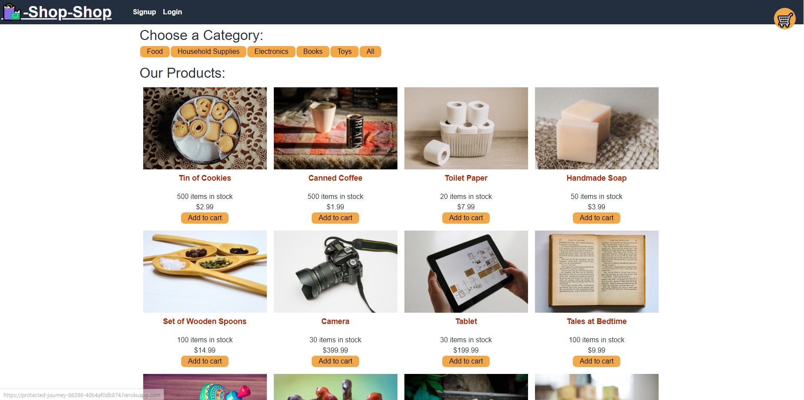

# Shop Shop
      

## Description

This is a test for a real e-commerce site! This includes Stripe, so that one could make a real payment. This app shows my knowledge in react redux! I have gutted the back end of this site and remade it into something that can support redux completely. The front end and some of the back end was provided by my edX bootcamp.
    
## Table of Contents

- [Installation](#Installation)
- [Usage](#Usage)
- [License](#License)
- [Contributing](#Contributing)
- [Tests](#Tests)
- [Questions](#Questions)
    
## Installation

To install this app, either clone my repo or fork it to your own account!

## Usage
    
To use this app, just click on the handy dandy link below.

## License

This project is covered under the MIT license. For more information, visit the link below.

[License Link](./LICENSE)

## Contributing

If you have suggestions, you can make an issue in this repo's issues tab!
    
## Tests

To test this application, clone the repo to your device and use npm run test!

## Link

Here is the link to the deployed version of this app:
https://protected-journey-88386-40b4af0db874.herokuapp.com
    
## Questions

Have any questions? This is how to contact me:

Github: https://github.com/RuckusEnjoyer
    